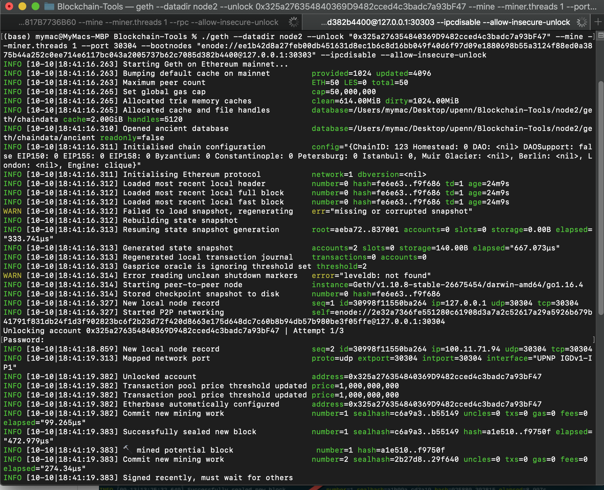

# ZBank Proof of Authority Development Blockchain

In this repository I built a private testnet blockchain for developers to use to explore the potentials for a blockchain at ZBank.

This testnet has no real money involved and allows for offline development, which gives developers freedom to experiment.

The following will explain the configuration of this network:

## Step 1: Create Nodes

There were 2 nodes created for this network using Go Ethereum(`geth`).

Using the terminal, the following commands were ran in the Blockchain Tools directory:

`./geth account new --datadir node1`

`./geth account new --datadir node2`

For security purposes no password was used in this demostration.

## Step 2: Generate Genesis Block 

In the Blockchain tools directory, run `puppeth`:

`zbank` was used to name the network

`Clique (Proof of Authority)` was selected for consensus algorithm.

Both nodes were funded and selected as sealers. 

After completing the prompts the genesis configuration was exported to `zbank.json`.

## Step 3: Initialize Nodes

Next run the following commands to initialize the nodes with the genesis json file:

`./geth --datadir node1 init zbank.json`
`./geth --datadir node2 init zbank.json`

## Step 4: Activate Mining Blocks

In separate terminal windows run the following commands:

`./geth --datadir node1 --unlock "0xF7e800e8cEe7117A2D873336Bc638817B7736B60" --mine --miner.threads 1 --rpc --allow-insecure-unlock`

`./geth --datadir node2 --unlock "0x325a276354840369D9482cced4c3badc7a93bF47" --mine --miner.threads 1 --port 30304 --bootnodes "enode://ee1b42d8a27feb00db451631d8ec1b6c8d16bb049f40d6f97d09e1880698b55a3124f88ed0a3875b44a252c0ee714e6117bc043a2005737b62c7085d382b4400@127.0.0.1:30303" --ipcdisable --allow-insecure-unlock`

The blockchain should now be running!

## Step 5: Send A Test Transaction

Open MyCrypto wallet and connect to the node with the exposed RPC port using the keystore file(`node1`). You will also need to use a custom network including the chain ID and ETH as the currency.

Send a transaction from the `node1` account to the `node2` account.

SUCCESS!!!